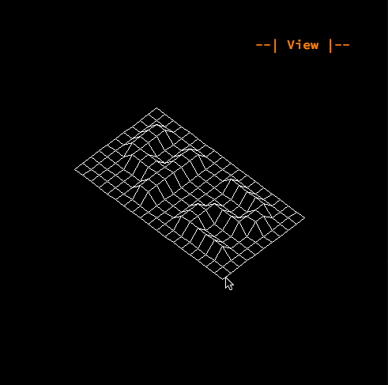

# FDF

A program about making a wireframe rendering
   
Usage : ./fdf [fdf_map]

**Enter :** Switch mode

### View mode

- **Left | Right /Up | Down arrows :** Rotate

- **Scrollwheel :** Zoom in /out

### Edit mode

- **Left | Right /Up | Down arrows :** Select vertex

- **WASD keys :** Move vertex

